<!-- markdownlint-disable MD024 -->

# HFLive13.0 技术指南

## 前言

2021 年 12 月 30 日，随着华附春晚最后一个节目的结束，HFLive13.0 完成了我们全部的直播任务。在今年的直播中，我们在继承前辈积累下来的大量经验，不断创新，尝试各种新技术，努力提高直播质量。

我们首次尝试 SDI In 接线技术，实现摄像机参数的统一控制和 Tally 信号发送至摄像机；我们重新探索校友连线方式，实现近五年来首次连线成功。

回首这一年，我们积累了许多经验，也留下了不少遗憾。但是，2021 已经过去，时光也不能倒流。华附直播的未来，在你们 14.0+ 的手上！因此，HFLive13.0 拍摄组组长郑哲楷、线路组组长阮渝航、技术组组长曹俊侯还有我，将我们今年的一些经验写在了这里。希望你们努力学习，勇敢创新，“成为中学生直播工作中的顶尖团队，没有之一。”（语出 HFLive9.0 总责刘畅）

华附直播团队第十三任总责助理 梁宇轩

2022 年 2 月 12 日于地铁上

## 拍摄组

### 前言 {#videographer-quote-before}

> 本内容是对于原有技术手册、《电视导播教程》的补充，默认读者已拥有相关知识。

### 摄像机参数问题 {#video-sdi-in}

#### 调参方式：SDI in 接入摄像机、切换台软件统一调参

在 12.0 及以前的直播中，摄像机的色温色调由导播根据不同机位画面的效果来通知拍摄进行调校。在 13.0 的直播中，直播团队首次（应该是吧）采用切换台软件统一调整参数。此方法需要我们将光端机子机的 SDI Out 接到摄像机机身的 SDI In 上去。与此同时，SDI In 还可辅助实现包括但不限于下列效果：

1. 节目信号传输。接入 SDI In 后，我们可通过按住摄像机机身上的 PGM 按钮来实现子机输出视频信号的监看。
2. 输出画面通知（Tally）。接入 SDI In 后，调出安全框，当导播将该画面切至 Program 时，摄像机 LCD 屏幕边缘即会出现红色边框；切至 Preview 时，屏幕边缘会出现绿色边框。可用于提示拍摄该画面正在/即将输出，注意平稳运镜。注意：该效果需要摄像机编号、光端机子机编号、切换台输入编号一一对应，即切换台 2 号输入口输入的是连接着 2 号子机的 2 号摄像机画面。
3. 参数调校。接入 SDI In 后，切换台端会放出信号，不断调整摄像机参数。此时，在摄像机机位的拍摄已经没法改动色温色调以及增益，因为一改动就会被切换台端调回去，但仍可以进行光圈的调节。因此，此时的色温色调增益参数需要由切换台端在电脑的切换台软件上进行调整。统一调节参数需要建立宏命令，将每个机位的参数记录在宏命令中，届时需要同时调节多台摄像机的参数时可以直接通过宏命令统一调节。（警告：录入宏命令时一定要保证其他人不应该动切换台，否则可能会导致启用宏命令时自动切换到某一画面甚至是彩条，死亡回放：2021 年华附春晚开头陈主任讲话）

#### 注意事项放送

1. 摄像机编号、子机编号、切换台输入的编号要一一对应。
2. 一定要提前和灯光组沟通好合适的参数并记录在宏命令中，一定要提前提前再提前将宏命令设置好，尽量提前 2 小时左右，并检查宏命令运行时是否会附带画面切换。
3. 一定要在摄像机被架上机位之前就统一调节好一切设置（最好放在地上摆一排调），调节好后焦，否则会出现两台机参数相同但是画面色彩不统一的情况。
4. 抓紧时间熟悉一下软件吧，说不定可以找到一些很不错的功能。

### 摩尔纹 {#moire-pattern}

#### 概念

当两个带有空间频率的图样重叠，通常会产生另一种新图样，这种新图样通常叫做摩尔波纹。由于摄像机的 CCD（图像传感器）靶面（感光面）类似于图中间的图形，而 LED 显示屏是由排列一致的点阵式发光管组成的，整个显示屏不发光面积大，形成了网格状的图样，类似左边的图像，两者重叠，就形成了类似于右边的摩尔纹。

摩尔纹的出现是我们在春晚画面问题中较大的一个。

#### 消除措施

1. 在传感器前使用抗混叠滤镜（也称为低通滤镜），然而这种滤镜会降低镜头的分辨率。因此，采取这种措施时必须要在摩尔纹以及分辨率之间做出取舍与妥协，不同型号相机的问题严重性不一，选择也不一样。
2. 相机角度。由于相机与物体的角度会导致摩尔波纹，稍微改变相机的角度（通过旋转相机）可以消除或改变存在的任何摩尔波纹。
3. 在 LED 显示屏表面叠加一层光学处理幕，该幕由特定比例的特殊吸光材料与表面微珠透镜涂层组成，通过光学处理幕对离散的 LED 发光点进行放大显示，改善 LED 显示屏的表面物理结构，使得 LED 显示屏由点发光转换成面发光，最终在光学处理幕表面形成连续的高清晰图像，消除摩尔纹。
4. 很显然，前面三种办法都不太适合我们，所以，写前面三种方法是为了让你们重视最后一种。调整焦点，使得表演者位置合焦而背景 LED 屏幕失焦。该方法需要跟拍摄不断强调不断强调。

## 线路组

### 前言 {#connect-quote-before}

> 本部分内容系原有线路组技术手册/线路组课程的补充，默认读者已具有相关基础知识。

### 电源 {#power}

13.0 购置了大量电线，电源线的铺设一般沿着光纤的线槽而不用额外加槽。注意不同长短电源线的配合使用。

另外，由于直播间内的电源在本届被告知存在漏电现象，会导致跳闸、与音控室的用电设备冲突，因此采用直播间门口的应急灯的应急电源，望周知。

### 网线 {#net-cable}

网线有连接器，但是建议尽量减少转接次数减少带宽损耗。

### 摄像机设置 {#connect-camera-setting}

摄像机在 Blackmagic 的官网有说明书，里面有详细功能的介绍。

需要特别注意设置的有：

1. 摄影机编号、子机编号、切换台编号有没有对应。
2. 输出接口是哪个。
3. 输出 SDI 的 level，关于 level 的设置问题后面会讲。
4. 输出画质和频率。

### SDI 的 Level 问题 {#connect-levelab}

当使用 SDI 的较高画质时（一般包括 1080p50/1080p59.94/1080p60），其信号又分为 Level A 和 Level B 两种类型，**互不兼容**。以下表格列出了我们的一些设备可以接受的类型：

| 设备                                          | 输入 Level | 备注                        |
| --------------------------------------------- | ---------- | --------------------------- |
| 威固无线图传                                  | A、B       | 不确定，是否支持 B 还需测试 |
| 小玛 400S Pro 无线图传                        | A、B       |                             |
| BMD 光端机子机（Blackmagic Camera Converter） | B          |                             |
| BMD 切换台（ATEM Production Studio 4K）       | B          |                             |
| 租赁的图传                                    | A、B       | 不确定，需要测试            |

以下表格列出了我们的一些设备可以输出的类型：

| 设备                        | 输出 Level | 备注           |
| --------------------------- | ---------- | -------------- |
| 电视台 DV 机（AG-DVX200MC） | A          |                |
| BMD 摄影机（URSA）          | A、B       | 可调           |
| 威固无线图传                | B          | 不确定，需测试 |
| 小玛 400S Pro 无线图传      | A          |                |
| 租赁的图传                  | A          |                |

从上面两个表格不难发现，BMD 公司普遍采用 Level-B 标准，而其他厂商大多采用 Level-A 标准，因此 BMD 的设备和其他设备连接可能会出现困难。例如，电视台 DV 机无法通过 SDI 向子机发送 1080p50 信号；无线图传接收端无法通过 SDI 将信号送进切换台。

注意，Level-A/B 的区分**仅限于**使用 SDI 传输 1080p50 以上（2160P 未经过测试）的信号。也就是说，使用 HDMI 传输**或者**使用 1080p50 以下的画质（如 1080i50）**不受** Level-A/B 的影响。

因此，当遇到 Level-A/B 不相同时，可以采取换用 HDMI 连接或降低画质的方法解决，需要在直播实践中特别留意。

## 技术组

### 直播间网络设备连接 {#net-setting}

我们直播所用到的设备都是通过同一个局域网进行连接，首先我们来介绍直播间的网络连接：

1. 路由器的接法是 WAN 进 LAN 出，即墙里出来的网线连路由器的 WAN 口，而其他所有需要用到路由器网络的设备则是连接到路由器的 LAN 口。
2. 交换机的接口要连接到路由器的 LAN 口，可以把交换器理解为路由器 LAN 口的扩展。
3. 使用交换器任意一个接口与切换台、导播台、电子调音台连接。
4. 计算机在连接直播间的网络（无线或有线）后均可以连接切换台和音控台。

::: tip 提示
当路由器由于意外情况断网时，电脑和手机有可能会自动断开 Wi‑Fi 连接，因此请尽量使用有线网络连接。
:::

{.dark-invert}

{.dark-invert}

### 多交换机级联 {#multi-switch}

交换机具有多个 RJ45 网口，默认情况下所有网口没有区别（没有 WAN 和 LAN 之分）。当用一台交换机连接到路由器的 LAN 口时，该交换机其他网口即可相当于连接到了路由器的 LAN 口。

需要注意的是，两台交换机之间只能用一路网线连接，
也就是只能有一条通路，否则会形成环回(loop)，无法正常工作。

网络部分还有很多知识，需要多上网学习。

### 采集卡声音采集 {#capture-sound}

采集卡声音采集历来是一个问题，下面将介绍采集卡采声的几个方法：

- 直连：使用圆刚或者绿联的采集卡直接进行采集，在 OBS 音频输出模式中选择输出到桌面音频（绿联不需要），然后添加音频输出采集，即可采集到 HDMI 接收到的舞台干声，不推荐。
- 采集卡加音频线：众所周知，在矩阵的输出口上，有音频线接口，用音频线连接矩阵以及用来上传的计算机，使用线路采集即可采集到声音，较稳定。
- 采集卡加采集卡：圆刚采集直播画面，绿联采集直播声音，方法如单个采集卡。

### 采集卡颜色问题 {#capture-color}

在 OBS 视频采集设备的滤镜中，看到下方的效果滤镜，选择色彩校正，一般在彩排时校正完成。

::: warning 注意
OBS 添加滤镜会直接影响输出画面，即使你打开了“工作室模式”，也会同时影响预监和输出两个画面。解决方法是分别调整两个采集卡的滤镜。比如圆刚采集卡 On Program 时就调整绿联采集卡，然后把绿联采集卡 On Program 上去，再调整圆刚采集卡的滤镜。
:::

### 采集卡信号问题 {#capture-video}

使用 HDMI 将信号输入采集卡，再通过 USB3.0 传入上传的计算机，在 OBS 的来源中选择视频采集设备，特别注意，圆刚的采集卡的分辨率/帧率类型要选择**自定义**，否则会出现无信号的状况，绿联随意，采声同上。

### 歌词显示问题 {#lyrics-display}

在各种节目中，我们总能遇到奇葩的歌词，下面以今年的《花之二重唱》为例，讲述非中英文歌曲在放歌词时因听不懂而不能正常播放的处理方法：

1. 找选手沟通，询问歌词大意，或者全套歌词，输入到 OBS 上的文本，让其进行滚动播放。
2. 我们需要将 OBS 的画面投影到现场屏幕上，否则现场无法看到滚动歌词。
3. 使用矩阵连接电脑，将信号输出到大屏幕，在 OBS 中选择全屏投影，即可将 OBS 的 Program 画面传输到现场大屏幕。

### 校友连线 {#alumnus}

校友连线是华附春晚亮点节目之一，也是直播团队的中心工作之一。2021 年我们采用了**腾讯会议 Rooms + 采集卡**方案。

#### 接线

{.dark-invert}

1. 用 3.5mm 公‑卡侬公线连接电脑和音响组的现场调音台。
2. 用 6.5mm 公‑6.5mm 公线连接现场调音台输出和电子调音台输入，可以使用直播间预埋的线。
3. 用双路卡侬公‑卡侬母线连接电子调音台输出和切换台输入。
4. 用 HDMI 连接切换台 Program 输出和矩阵输入。
5. 用 HDMI 连接矩阵输出和采集卡，用 USB 连接采集卡和电脑。
6. 用 HDMI 连接矩阵输出到现场大屏控制器。

::: tip 提示
现场调音台、现场大屏的连接可以与凌燃燃老师沟通。
:::

#### 配置

##### 电脑配置

1. 将电脑输出画质更改为与切换台一致。
2. 将默认音频输入设备更改为采集卡输入（如 Capture Audio）。
3. 将默认音频输出设备更改为耳机孔输出。

##### 腾讯会议 Rooms 配置

1. 将音频输出设为耳机孔输出（如“耳机 (Synaptics Audio)”）。
   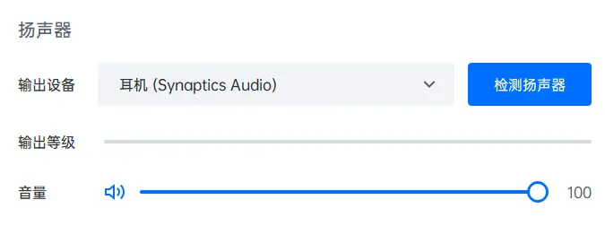
2. 音频输入设为**采集卡输入**（如 Capture Audio）；在高级设置中，启用“使用设备原声”，开启“回声消除”，关闭“音频降噪”。
   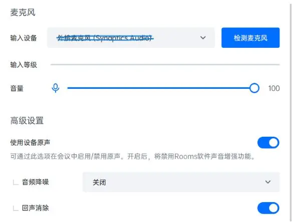
3. 摄像头输入设为采集卡输入（如 Capture Video）。
   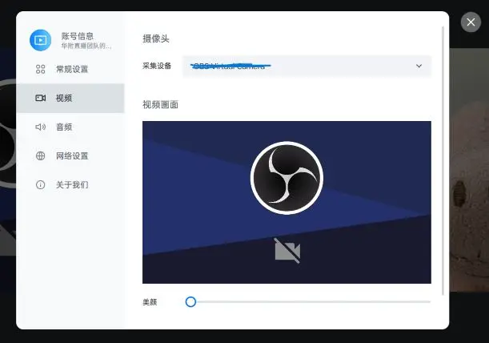
4. 将双屏设置为“扩展模式”。
   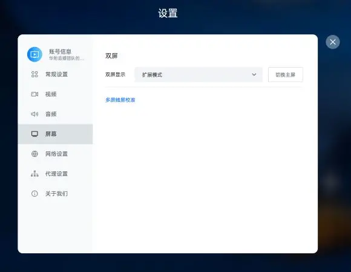
5. 为防止意外，关闭“入会开启摄像头”“入会开启麦克风”“语音激励”“隐藏非视频参会者”；为获得更纯净的画面，关闭“会中常驻投屏码”。
   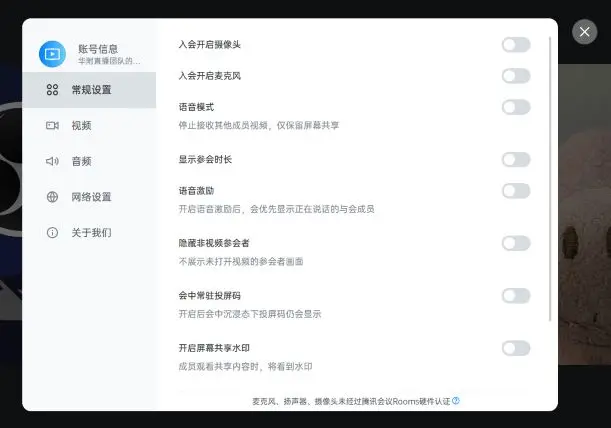

::: tip 提示
软件可能会经常提示“麦克风、扬声器、摄像头未经过腾讯会议 Rooms 硬件认证”等，忽略即可。
:::

##### 电子调音台配置 {#电子调音台配置-1}

在电子调音台中，我们要确保现场调音台的输入能正确输出到 Main LR。

> 电子调音台相关配置可以请求音组协助，但还是建议技术组同学学习电子调音台基本操作方法。[产品官网](https://www.behringer.com/product.html?modelCode=P0BI8)

##### 矩阵设置 {#矩阵设置}

在矩阵中，将切换台 Program 输出正确映射到采集卡和现场大屏。

经过以上配置，参会者的声音能输出到现场的音响系统，参会者的画面能显示在切换台 Multiview 画面上，能输出到 Program；现场 Program 的画面和声音能够上传腾讯会议，参会者能听到现场的声音，能看到现场的画面。这也是校友连线的基本要求。

#### 现场工作

校友连线非常考验现场的操作和应急情况处置能力。

- 在主持人讲话时，提醒导播切到摄影机画面，在微信群通知下一个连线的地区。
- 主持人与连线地区互动时，将该地区设为焦点画面，提醒导播将画面切到校友。
- 出现突发故障时，第一时间使用对讲机通知主持人，立即确定故障位置并通知相关人员进行排障。

::: tip 提示
校友连线前，要进行大量的测试。必须至少一次按春晚流程进行 1:1 测试。同时，与校友连线负责人和主持人密切沟通，确认应急方案。
:::

#### 故障排除

1. 信号进不了切换台：检查 HDMI 连线、画质。
2. 现场大屏无信号：检查矩阵设置、HDMI 线连接、现场大屏控制台设置。
3. 校友听不到声音：检查 Program 是否有声音，检查腾讯会议设置，检查麦克风是否关闭。
4. 现场听不到声音：检查腾讯会议输出设置，检查现场调音台设置，检查连线。

#### 提升

由上面的一系列配置不难发现，腾讯会议 Rooms 输出的校友声音最终又送回了腾讯会议 Rooms 输入里，我们依靠“回声消除”才能勉强不造成直播事故。因此 HFLive14.0+ 一定要不断尝试创新，在确保稳定性的前提下努力提高质量。以下建议供参考：

1. 优化接线方案。
   {.dark-invert}
2. 尽量让校友多进行几次测试，特别是要让他们试一下像春晚那样大声喊的时候会不会炸麦。测试的时候要叫上音组的同学，也让他们演练一下到时候的音量控制。
3. 让校友尽量佩戴耳机，或者让他们的扬声器尽量远离麦克风，防止回荡。（比如另外用一台手机入会来听现场声音，电脑来录画面和声音）。
4. 试用切换台 AUX 输出方案：切换台有三路 SDI 接口的 AUX 输出，可以在切换台前面板活软件控制面板控制这三路输出什么内容（可选的包括但不限于：某一机位画面、PGM、MediaPlayer 等），我建议将一路 AUX 输出（如 AUX1）拉出来，经 SDI 转 HDMI 进矩阵，再拉到现场大屏幕。这样在部分节目需要在现场大屏播放视频时就可以将 AUX1 设为切换台输入 1:VCR，然后在我们这边播视频；在校友连线时可以分别控制现场大屏和直播画面，让现场更多时间能看到校友。
   此外，AUX 输出还可以作为应急 PGM 使用。当切换台烧网口导致软件和硬件面板都无法连上的时候，仍然可以通过切换台前面板的实体按键控制 AUX 输出，实现硬切换，这个留待你们探索。详情参考切换台说明书的“辅助输出”部分说明。

### 无人机信号连接 {#drone}

无人机机位主要在小歌手时使用，其独特的视角能大幅提高直播质量。2021 年，HFLive13.0 使用的是**DJI Mavic 2 + RTMP 局域网传输 + OBS 拉流 + 光端机 + 切换台**方案，实现 720P 传输。

> 后记：突然发现在 DJI Go 里面把图传模式设置成“高清模式”就可以实现 1080P 传输，之前直播一直用的是普通模式就只有 720P……血亏

该方案适用于大部分大疆无人机，此处以 DJI Mavic Pro 为例。

### 准备

#### 硬件

- DJI Mavic Pro 无人机一台
- 遥控器
- 手机
- 电脑
- 光端机子机（Blackmagic Camera Converter）
- 光端机母机（Blackmagic Studio Converter）
- 切换台（ATEM Production Studio 4K）

#### 手机软件

- DJI Go 4
- RTMP‑Server [（蓝奏云下载 访问码: f52x）](https://wwu.lanzout.com/io3Xsz1egvc) 或 [OneDrive（可能需要 ✈）](https://1drv.ms/u/s!An9BdN5oWRYghj7dU5rAuiv40oO_?e=EcPoSL)

#### 电脑软件

- OBS（Open Broadcaster Software）

### 接线

相关连线图如下：

{.dark-invert}

1. 参考无人机使用说明，将手机连接到无人机遥控器。
2. 将手机和电脑连到同一局域网下（同 Wi‑Fi）。
3. 用 HDMI 连接电脑和光端机子机，注意更改画质。
4. 用光纤连接光端机子机和母机（请线组协助）。
5. 用 SDI 将光端机母机连接到切换台。

### 无人机连线配置

#### 服务器配置

1. 打开 RTMP‑Server 软件，开启服务。
   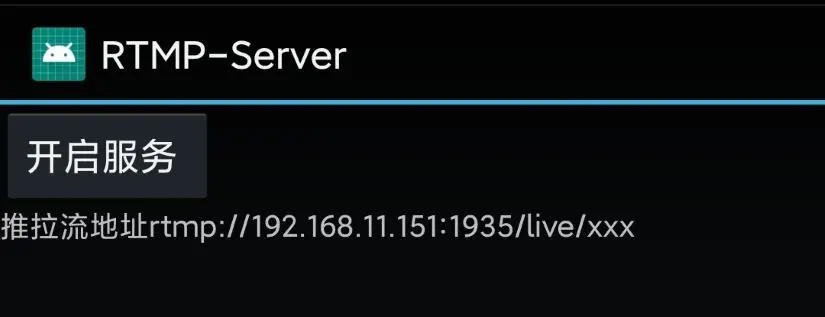
2. 设置，防止手机杀后台。（请在搜索引擎搜索：`XX 品牌手机 如何防止杀后台`）。

#### 大疆飞控软件设置

1. 打开 DJI Go 4，连接飞行器。
   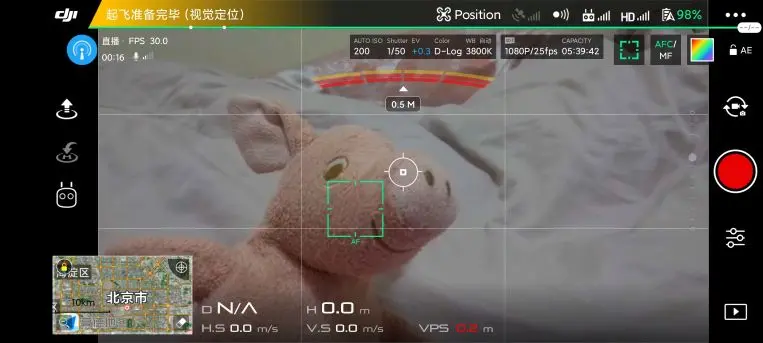
2. 打开设置，“选择直播平台”。
   
3. 填入推流地址，开始直播。
   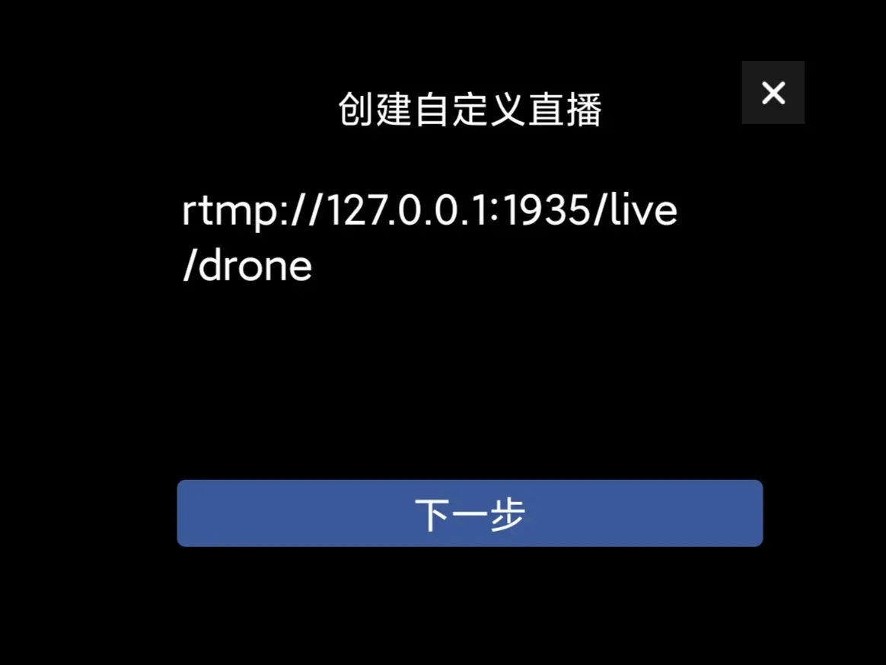
   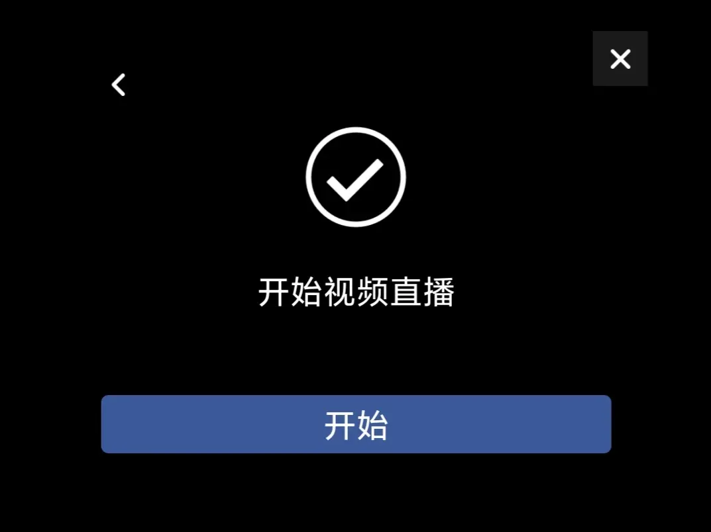
4. 推流开始后，能在左上角看到相关提示。若能看到帧率值则代表直播正常，若 FPS 为 0 则代表推流失败，需检查服务器状态和推流参数。

#### OBS 配置

1. 启动 OBS，新建媒体源。
   
2. 在媒体源设置中，取消勾选“本地文件”，“网络缓冲”设置为 `0 MB`，“输入”设置为 `rtmp://手机IP地址/live/drone`，确认设置。（如使用 rtsp-simple-server，将拉流地址改成 `rtsp://电脑IP:8554/xxx`）。
   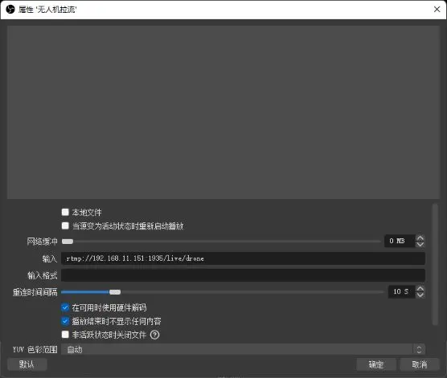
3. 经过以上设置后即可在 OBS 窗口中看到无人机画面。
   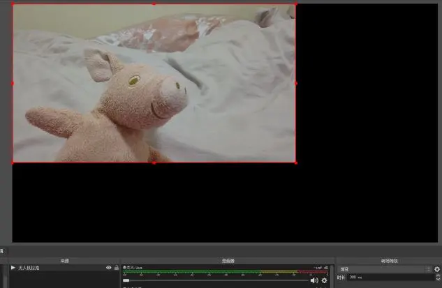
4. 右键源，全屏投影到第二屏幕，这时就能在切换台 Multiview 中看到无人机的画面了。
   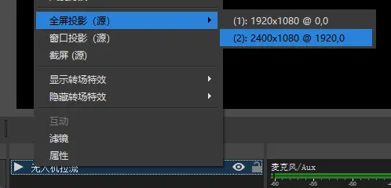

### 提升

该方案成本低，但也有不少缺点，包括延迟高、配置麻烦、稳定性不佳、画质低。因此，我们建议 HFLive14.0+ 换用更好的方案。以下两个方案供参考：

- 租用/购买大疆带屏遥控器，其能输出 HDMI 信号。
- 使用大疆精灵系列无人机，购买遥控器 HDMI 输出模块。

## 其它技术

### 舞台干声处理 {#dry-sound}

舞台干声，是指现场调音台输出的各种声音，主要包括：现场各种表演麦克风、表演音乐等。舞台干声的收录和处理是直播的重要内容之一。如果没有声音，画面拍得再好也是一次失败的直播。直播收声原理如下图所示：

{.dark-invert}

#### 接线

1. 使用两路 6.5mm‑6.5mm 音频线连接现场调音台输出和电子调音台的输入。HFLive13.0 使用的是在墙体内预埋的音频线，连接现场调音台的 AUX3/4 输出。
2. 使用两路卡侬（XLR）线连接电子调音台的 Main LR 输出和切换台的输入。

#### 配置

##### 电子调音台配置

调整电子调音台，使输入的舞台干声能正常输出到 Main LR。

##### 切换台配置

在切换台软件控制面板的音频面板中，启用来自 XLR 的声音，调整音量大小。

经过以上设置后，舞台干声即可进入直播 Program 中。

### 现场声的收录 {#audience-sound}

现场声音的收录是直播声音的重要一环，HFLive12.0 和 13.0 在这方面有所欠缺，HFLive14.0+ 务必重视直播的声音！

#### 连线

{.dark-invert}

{.dark-invert}

现场声的连线非常简单，只需要将一只（最好是两只）麦克风连接到摄影机或光端机子机上，声音信号就会随视频一起传回切换台。

#### 配置

若连接至摄影机，需要在摄影机中设置音频为 XLR 输入，具体参考 [URSA 说明书](https://documents.blackmagicdesign.com/UserManuals/BlackmagicURSAMiniManual.pdf#page=1580) 第 1580 页。

若连接至子机，子机会自动采用外接的麦克风，具体参考 [子机说明书](https://documents.blackmagicdesign.com/UserManuals/ATEMConvertersManual.pdf#page=138) 第 138 页“连接音频”部分。

无论采取哪种连接，都要在切换台中启用该路信号的音频，并调整音量大小，具体参考 [切换台说明书](https://documents.blackmagicdesign.com/UserManuals/ATEM_Production_Studio_Switchers_Manual.pdf#page=1217)。
