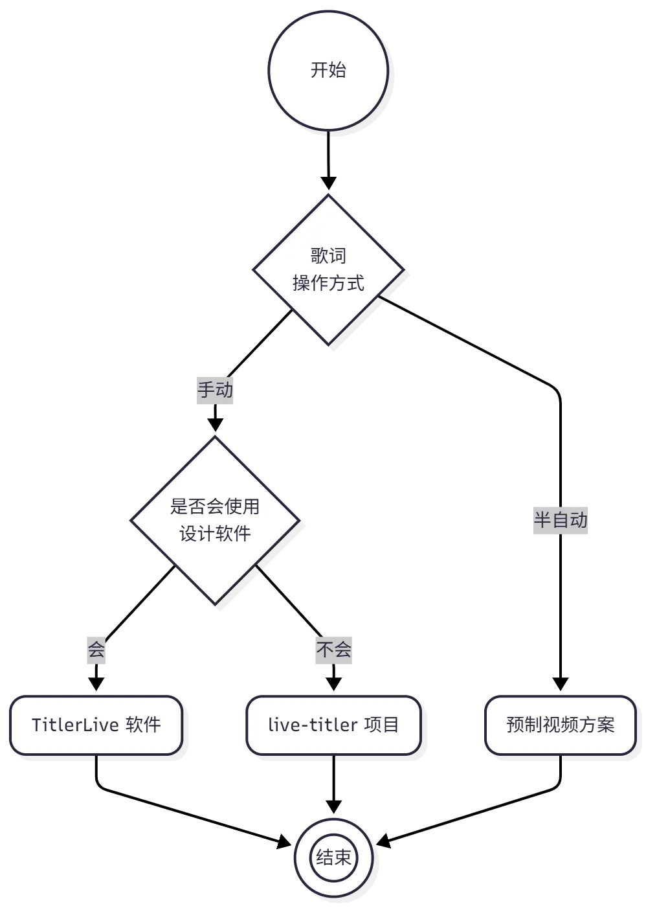

<!-- markdownlint-disable MD024 -->

# 歌词显示

## 概述

歌词显示主要在小歌手大赛和春晚直播中使用，通过在直播中展示美观的歌词样式和歌词动画效果，显著提升直播的艺术效果。

实现歌词显示的软件很多，HFLive 历届进行了大量的探索，包括但不限于：

1. MizarZh 学长于 2020 年开发的基于网页的歌词播控系统 [HFLIVE-Subtitler](https://github.com/MizarZh/HFLIVE-Subtitles)。
2. HFLive12.0 探索的基于 PotPlayer + LRC 歌词文件的绿幕扣像歌词显示方案。
3. xiaoxuan010 学长于 2022 年开发的基于 OBS + 网页的歌词/报幕条显示系统 [live-titler 方案](#live-titler-solution)。
4. 笔者在 2022 年探索的基于 TitlerLive 软件的直播包装显示方案（[TitlerLive 方案](#titlerlive-solution)）。
5. （设想中）通过播放提前制作的**动态歌词排版视频**的[预制视频方案](#premade-video-solution)。

总结历年经验，在不引入付费商业软件的条件下，暂时未能找到最佳的歌词显示方案，因此需要根据具体的直播需求和可用于制作歌词的空余时间，选择合适的歌词显示方案。

## 方案选型

实际上，推荐的方案不多，可以按照以下流程图进行初步选型。其中，在条件允许的情况下，最推荐使用的是 TitlerLive 软件，最容易上手的是 live-titler 项目，技术难度低且效果最好的是预制视频方案。

 {.dark-invert}

下面具体介绍每种方案的优缺点及使用方法。

## live-titler 方案 {#live-titler-solution}

[live-titler](https://github.com/HFLive/live-titler) 是我在 2022 年简单开发的一个基于 OBS 浏览器源的歌词/报幕条显示系统，优缺点如下：

### 优点

- 已经提前写好样式和动画，不需要自己设计。
- 可以导入 LRC 格式的歌词，可以设置每行歌词的动画时间。
- 控制简单，好上手。
- 可以使用 OBS 浏览器源展示歌词，不需要扣像，显示效果好。

### 缺点

- 需要在推流电脑的 OBS 中控制歌词，暂不支持使用另一台电脑控制。
- 需要装几个字体。
- 样式和动画是固定写死的，要修改的话需要改代码。

### 使用方法

参见项目说明的 [README 文件](https://github.com/HFLive/live-titler)。

## TitlerLive 方案 {#titlerlive-solution}

TitlerLive 是商用的直播包装软件，可以实现更复杂的直播包装效果，可玩性也很高，优缺点如下：

### 优点

- 功能强大，支持很多复杂的动画效果。
- 除了歌词以外，还可以显示台标 Logo、报幕条、倒计时等多种直播包装内容。
- 可以使用 OBS TitlerLive 源直接显示在 OBS 中，不需要扣像，显示效果好。
- 可以使用 NDI 进行局域网内画面传输，使歌词控制电脑和推流电脑分离。
- 可以导入包括视频在内的各种素材，可玩性高。
- 可以导入或者自己编写插件（笔者本人就写过一个倒计时插件，效果很好）。

### 缺点

- 商业软件，需要自行解决激活问题。
- 界面没有中文，上手有一定难度。
- 需要自己设计歌词样式和动画，需要一定的美术功底。
- 对电脑性能要求较高，否则会卡。
- 编辑不是特别好用，没有 PR 等剪辑软件那么好用。

## 预制视频方案 {#premade-video-solution}

该方案是最近的设想，已进行初步验证确实可行。该方案的思路是：

1. 使用视频剪辑软件提前制作好“动态歌词排版”视频。这一步骤技术难度不大，使用PR、剪映等软件均可完成。
   - 达芬奇虽然操作方便，但是教程和模板等资源较少，导出带 Alpha 通道的视频也不是特别顺利，因此不做推荐。
   - 剪映模板很多（有免费的），容易上手，且可以直接导出 RLE 格式的透明背景视频。但是，将模板“应用到全部字幕”的功能居然需要 VIP 才能使用，这意味着无法直接导入歌词批量生成动画，而是必须每一行歌词手动添加，工作量会比较大。但是如果学校报销剪映 VIP 的话，是最为推荐。
   - PR 功能完整，网上的动态歌排模板很多都是 PR 的 `.mogrt` 格式，有些模板还可以导入歌词文件全自动生成动画。如果熟悉 PR 的话，是比较推荐的选择。

2. 将视频导入到 OBS，在节目开始时卡点开始播放。

### 优点

- 显示效果最好，可以实现非常复杂的动态歌词排版效果。
- 可以自动播放歌词，不需要手动控制每行歌词的切换。
- 不需要额外的软件，只需要 OBS 播放视频。

### 缺点

- 需要提前制作好歌词视频，工作量可能会比较大。
- 无法临场准确控制歌词切换，可能会导致歌词和现场演唱不同步。
- 需要提前拿到表演者演唱的录音 demo，以便对齐歌词的时间点。

（未完待续）
